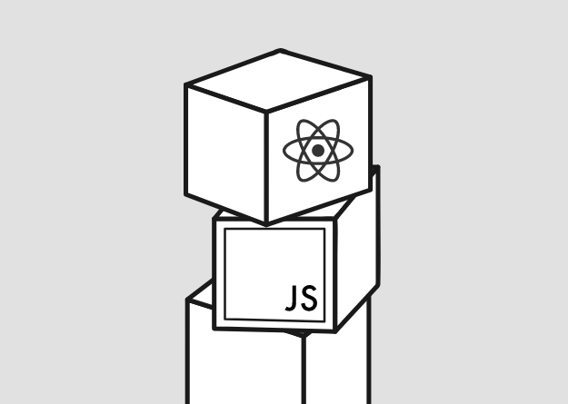

<!DOCTYPE html>
<html>
    <head>
        <meta charset="utf-8">
        <title>My first web page</title>
    </head>
    <body>
        
This is my<strong>first</strong> web page.  
        I'm very happy to join in this study program and study with classmates around the world. 
        This is the link about this study program: <a href="https://fullstackopen.com/en/">fullstackopen</a>.

        
        

        This is an introduction of this course: 
        <blockquote>This course serves as an introduction to modern web application development with JavaScript. The main focus is on building single page applications with ReactJS that use REST APIs built with Node.js. The course also contains a section on GraphQL, a modern alternative to REST APIs.  
        The course covers testing, configuration and environment management, and the use of MongoDB for storing the application’s data.</blockquote>
        

        

        Here are my goals:
        <ul>
            <li> Fullfil this course in 6 months.</li>
            <li> Complete all the homework by myself and make some userful websites.</li>
            <li> Find something interesting and apply my knowledge to solve real problems.</li>
        </ul>
        

    </body>
</html>
